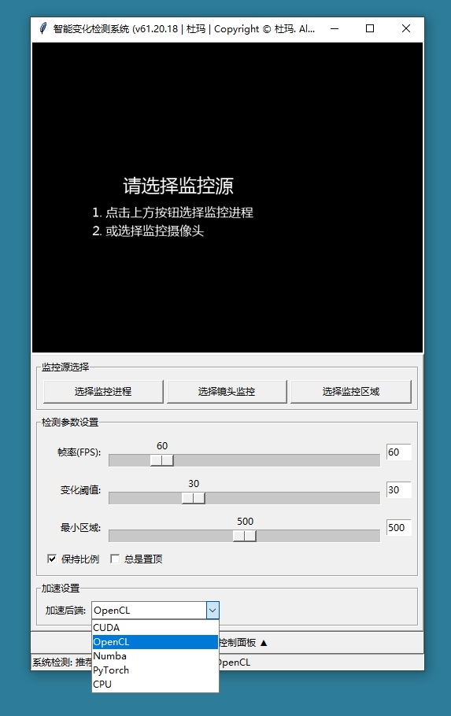

# 智能变化检测系统使用说明书

## 一、产品概述

智能变化检测系统是一款专业的实时监控软件，能够检测并标记指定窗口或摄像头画面中的变化区域。本系统适用于多种场景，包括但不限于：

- 安全监控：检测监控画面中的异常移动
- 软件开发：测试UI界面变化
- 教育培训：记录教学演示过程变化
- 科研实验：观察实验过程中的细微变化
- 游戏开发：检测游戏画面变化

## 二、系统要求

### 硬件要求：
- 操作系统：Windows 7/8/10/11
- 处理器：Intel Core i3或同等性能以上
- 内存：4GB以上
- 显卡：支持OpenCV的显卡
- 摄像头（如需使用摄像头监控功能）

### 软件要求：
- Python 3.6或更高版本
- OpenCV库
- Pillow库
- pywin32库
- psutil库
- mss库

## 三、安装指南

1. 确保已安装Python 3.6或更高版本
2. 使用pip安装所需库：
   ```
   pip install opencv-python pillow pywin32 psutil mss
   ```
3. 下载本软件脚本文件`real_time_detection.py`
4. 双击运行或通过命令行执行：
   ```
   python real_time_detection.py
   ```

## 四、功能说明

### 1. 主界面介绍

主界面分为以下几个区域：
- 监控源选择区：选择监控进程或摄像头
- 监控区域控制区：设置监控范围和窗口大小
- 检测参数设置区：调整检测敏感度和显示参数
- 状态显示区：显示当前系统状态

### 2. 核心功能

#### 2.1 监控源选择

- **选择监控进程**：监控指定应用程序窗口的变化
  - 点击"选择监控进程"按钮
  - 在弹出的窗口列表中选择目标进程
  - 双击或点击"确定"开始监控

- **选择镜头监控**：监控摄像头画面变化
  - 点击"选择镜头监控"按钮
  - 在弹出的摄像头列表中选择可用摄像头
  - 点击"确定"开始监控

#### 2.2 监控区域控制

- **调整结果窗口大小**：调整显示窗口的初始大小
- **选择目标监控区域**：在目标窗口上划定特定监控区域
  - 点击按钮后，在目标窗口上拖动鼠标选择区域
  - 释放鼠标左键确认选择

#### 2.3 检测参数设置

- **帧率(FPS)**：调整检测频率(1-120FPS)
  - 使用滑块或直接输入数值
  - 按回车键确认

- **变化检测阈值**：设置变化检测的敏感度(1-100)
  - 数值越小越敏感
  - 使用滑块或直接输入数值
  - 按回车键确认

- **最小变化区域**：设置被识别为变化的最小区域大小(1-1000像素)
  - 过滤掉微小变化
  - 使用滑块或直接输入数值
  - 按回车键确认

#### 2.4 显示选项

- **置顶变化结果面板**：保持结果窗口在最前端显示
- **结果窗体按比例缩放**：保持窗口宽高比不变
- **结果窗口内图像按比例缩放**：保持图像原始比例显示

## 五、使用场景指南

### 1. 安全监控场景

1. 点击"选择镜头监控"选择监控摄像头
2. 调整"变化检测阈值"至适当敏感度(建议30-50)
3. 设置"最小变化区域"过滤微小变化(建议500-800)
4. 勾选"置顶变化结果面板"保持监控画面可见

### 2. 软件测试场景

1. 启动待测试应用程序
2. 点击"选择监控进程"选择应用程序窗口
3. 点击"选择目标监控区域"划定需要监控的UI区域
4. 设置较高帧率(60-120FPS)捕捉快速变化
5. 执行测试操作，观察变化检测结果

### 3. 教育培训场景

1. 选择演示应用程序或摄像头作为监控源
2. 设置适中帧率(30FPS)和检测阈值(40)
3. 开始演示，系统会自动标记变化区域
4. 可随时调整参数优化检测效果

## 六、常见问题解答

### Q1: 为什么检测不到变化？
- 检查"变化检测阈值"是否设置过高
- 确认"最小变化区域"设置是否过大
- 确保监控源画面确实有变化

### Q2: 检测结果窗口无法显示？
- 确认已选择监控源(进程或摄像头)
- 检查显卡驱动是否正常
- 尝试重新启动软件

### Q3: 如何提高检测精度？
- 降低"变化检测阈值"
- 减小"最小变化区域"值
- 提高帧率设置
- 划定更精确的监控区域

### Q4: 系统占用资源过高怎么办？
- 降低帧率设置
- 提高"变化检测阈值"
- 增大"最小变化区域"值
- 划定更小的监控区域

## 七、注意事项

1. 长时间监控可能导致系统温度升高，请注意散热
2. 高帧率设置会增加CPU和GPU负载
3. 选择监控区域时，确保目标窗口不被其他窗口遮挡
4. 摄像头监控时，环境光线变化可能影响检测结果
5. 本软件仅供合法用途使用

## 八、版本信息

当前版本：v61.2.0
开发者：杜玛
版权信息：Copyright © 杜玛

## 九、技术支持

如有任何技术问题或建议，请联系开发者邮箱或通过GitHub提交issue。

---

本说明书涵盖了智能变化检测系统的各个方面，适用于不同技术水平的用户。从安装配置到高级使用技巧，提供了全面的指导。用户可根据自身需求参考相应章节，快速掌握系统使用方法。



